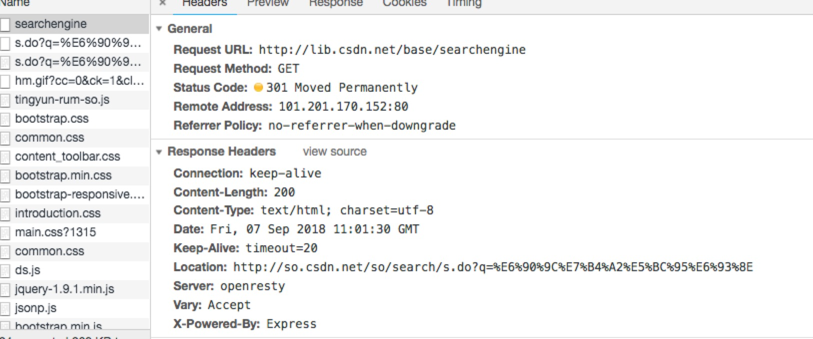

#### 301和302都是重定向，他们之间有什么区别呢？

来看官方的解释，

> **301 Permanently Moved**
> 被请求的资源已永久移动到新位置，并且将来任何对此资源的引用都应该使用本响应返回的若干个URI之一。如果可能，拥有链接编辑功能的客户端应当自动把请求的地址修改为从服务器反馈回来的地址。除非额外指定，否则这个响应也是可缓存的。
> 
> **302 Temporarily Moved**
> 请求的资源现在临时从不同的URI响应请求。由于这样的重定向是临时的，客户端应当继续向原有地址发送以后的请求。只有在Cache-Control或Expires中进行了指定的情况下，这个响应才是可缓存的。
<!-- more -->

字面区别是301是永久重定向，302是临时重定向。301和302状态码都表示重定向，就是说浏览器在拿到服务器返回的这个状态码后会自动跳转到一个新的URL地址，这个地址可以从响应头的Location首部中获取（用户看到的效果就是他输入的地址A瞬间变成了另一个地址B）——这是它们的共同点。他们的不同在于。301表示旧地址A的资源已经被永久地移除了（这个资源不可访问了）。302表示旧地址A的资源还在（仍然可以访问），这个重定向只是临时地从旧地址A跳转到地址B,搜索引擎会抓取新的内容而保存旧的网址。


##### 301永久重定向
比如：访问`http://lib.csdn.net/base/searchengine`被永久重定向到`https://so.csdn.net/so/search/s.do?q=%E6%90%9C%E7%B4%A2%E5%BC%95%E6%93%8E`


请求后的状态码为301，并在返回头的Location中会指明重定向的目标地址。

同时301请求可以缓存（See Status Code，后边写着from cache）

如果你把网页的后缀从.php改为.html，301也是非常适合的。

把网站从http重定向到https，301也非常适合。

##### 302用来做临时跳转
比较常用的场景是做域名跳转。比如未登陆的用户访问用户中心重定向到登陆页面。访问404页面会自动重定向到首页


##### nginx 301、302配置

rewrite后面接上permanent就代表301跳
```js
//把来自veryyoung.me的请求301跳到 www.veryyoung.me
if ($host != 'veryyoung.me') {
    rewrite ^/(.*)$ http://www.veryyoung.me/$1 permanent;
}
```
接上redirect代表302跳
```js
//把来自veryyoung.me的请求302跳到 www.veryyoung.me
if ($host != 'veryyoung.me') {
    rewrite ^/(.*)$ http://www.veryyoung.me/$1 redirect;
}
```
##### 301、302 Java实现
```java
//301
response.setStatus(HttpServletResponse.SC_MOVED_PERMANENTLY);
response.setHeader("Location", "http://somewhere/");
```
```java
//302
response.setStatus(HttpServletResponse.SC_MOVED_PERMANENTLY);
response.sendRedirect("http://somewhere/");
```
