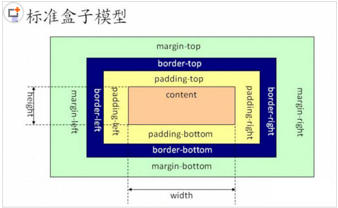

### 分类
- 标准盒模型（W3C盒模型）content-box   Element width = content


<!-- more -->

- 怪异盒模型（IE盒模型）border-box  Element width = Border +Padding +Content

注意：box-sizing属性从IE8开始被支持，其它浏览器可放心使用

盒子模型：由content, padding, border, margin组成的视觉格式化模型，被称之为盒模型；
1. 外补白 margin
2. 边框 border
3. 内补白 padding
4. 内容 content

```html
<div class="container-1"></div>
<div class="container-2"></div>
```
```css
.container-1 {
    width: 50px;
    height: 50px;
    background: red;
    box-sizing: content-box; /* border-box */
    padding: 30px;
    border: 30px solid green;
    margin: 30px;
    font-size: 80px;
    line-height: 80px;
}
.container-2 {
    width: 50px;
    height: 50px;
    background: red;
    box-sizing: border-box; /* border-box */
    padding: 30px;
    border: 30px solid green;
    margin: 30px;
    font-size: 80px;
    line-height: 80px;
}
```
```js
document.write('container-1-clientHeight ' + document.querySelector('.container-1').clientHeight + ',')
document.write('container-1-offsetHeight ' + document.querySelector('.container-1').offsetHeight + ',')
document.write('container-1-height ' + window.getComputedStyle(document.querySelector('.container-1')).getPropertyValue('height'))
document.write('<br/>')
document.write('container-2-clientHeight ' + document.querySelector('.container-2').clientHeight + ',')
document.write('container-2-offsetHeight ' + document.querySelector('.container-2').offsetHeight + ',')
document.write('container-2-height ' + window.getComputedStyle(document.querySelector('.container-2')).getPropertyValue('height'))

```
效果： https://codepen.io/lozoe/pen/oPPGBw

避免以下情况的发生：

1. 文件类型描述(Doctype)缺失或不完整时；
2. 遇到一个HTML3或者更早的文档时；
3. 使用HTML 4.0 Transitional或Frameset的文件类型描述且系统标识符（URI）不存在时；
4. 在DOCTYPE声明之前出现SGML注释或者其它无法识别的内容时；
5. IE6在DOCTYPE声明之前出现XML声明