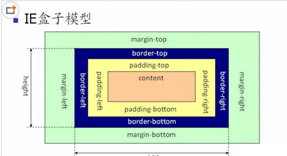

### 分类
- 标准盒模型（W3C盒模型）content-box   Element width = content

<!-- more -->

- 怪异盒模型（IE盒模型）border-box  Element width = Border +Padding +Content

注意：box-sizing属性从IE8开始被支持，其它浏览器可放心使用

盒子模型：由content, padding, border, margin组成的视觉格式化模型，被称之为盒模型；
1. 外补白 margin
2. 边框 border
3. 内补白 padding
4. 内容 content

避免以下情况的发生：

1. 文件类型描述(Doctype)缺失或不完整时；
2. 遇到一个HTML3或者更早的文档时；
3. 使用HTML 4.0 Transitional或Frameset的文件类型描述且系统标识符（URI）不存在时；
4. 在DOCTYPE声明之前出现SGML注释或者其它无法识别的内容时；
5. IE6在DOCTYPE声明之前出现XML声明