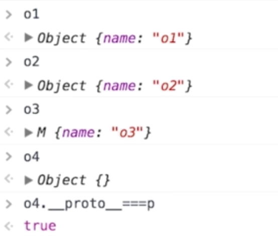
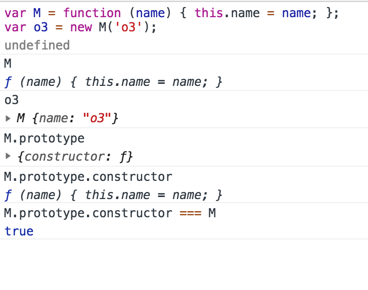
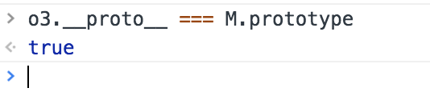
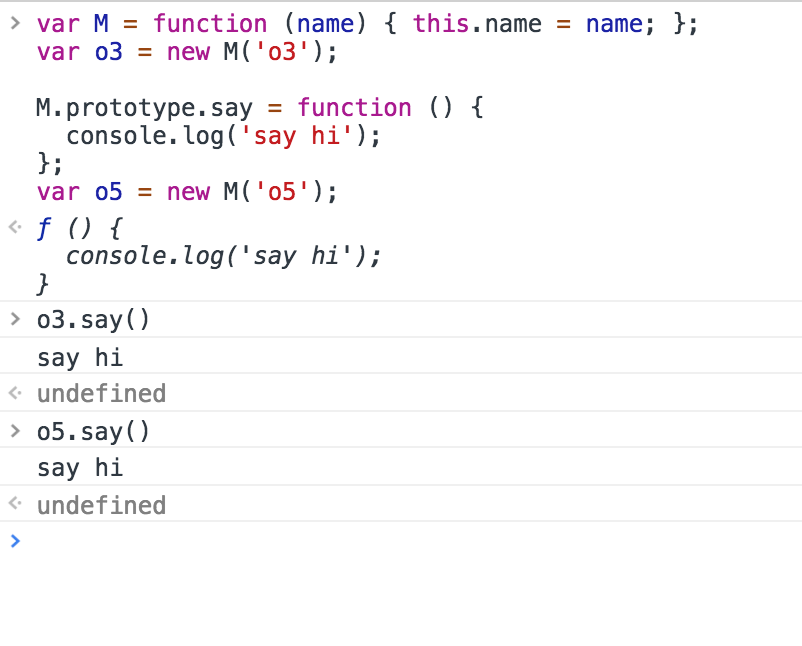
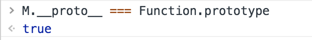
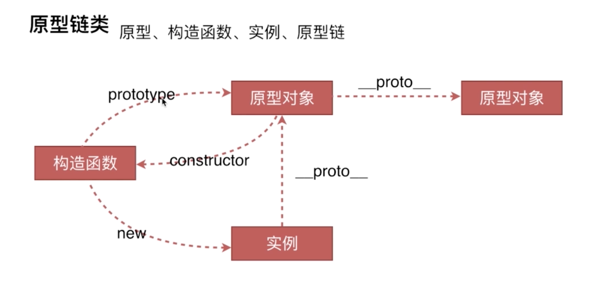

# 创建对象有几种方法
1. 第一种方式：字面量
2. 第二种方式：构造函数
3. 第三种方式：Object.create
```
// 第一种方式：字面量
var o1 = {name: 'o1'};
var o2 = new Object({name: 'o2'});
// 第二种方式：构造函数
var M = function (name) { this.name = name; };
var o3 = new M('o3');
// 第三种方式：Object.create
var p = {name: 'p'};
var o4 = Object.create(p);
```
<!--more-->



# 原型、构造函数、实例、原型链

描述：
1. 原型指的是后面两个原型对象
2. 构造函数：凡是通过new来操作后面的函数，那么这个函数不是一个普通函数，它是一个构造函数。即使里面没有this.xx='xx'也是构造函数
3. 实例：o1、o11、o2

构造函数是可以使用new运算符来生成一个实例
构造函数也是函数，函数都有一个prototype属性（prototype属性是在声明一个函数时，js引擎会自动给之加上这个属性，这个属性会初始化成一个空对象），这个prototype指的就是原型对象。

那么原型对象怎么区分它是被哪一个构造函数所引用？
构造器constructor,原型对象中有一个构造器constructor,这个构造器会默认声明的那个函数

工作原理eg.



==那么生成的实例和原型对象之间是什么关系？==
实例的__proto__属性指向构造函数的prototype属性


==什么是原型链？==
大白话说，原型链就是从一个对象往上找，构造这个实例的相关联的对象，然后这个关联的对象再往上找，它又有创造它的上一级的原型对象，以此类推，一直到Object.prototype原型对象终止。也就是说Object.prototype是整个原型链的顶端。

==那么原型链是通过什么来实现向上找的过程呢？==
其实就是通过prototype原型和__proto__属性来完成原型链的查找。

==原型链和原型对象之间到底起到了一个什么作用呢？==
构造函数中增加了很多属性和方法，当每个实例都需要共用某个方法，不能每个实例拷贝一份他们之间共用的这个方法可以考虑放到他们共同拥有的原型对象上。



按照JS对象JS引擎的分析方式，在访问一个实例的时候，比如实例上访问一个方法，如果实例本身没有找到这个方法时，往这个实例本身的原型对象上找，也就通过__proto__它的上一级原型对象上找，如果在它的上一级原型对象上还没有找到这个属性和方法，它会在它原型对象的基础上在通过原型对象的这个__proto__再往上一级查找，以此类推，直到找到Object.prototype，如果到此还没有找到那个属性和方法，则原路返回，告诉他没有找到没有定义。如果在中间任意一个环节找到了，就停止继续向上查找，直接返回这个方法用处。

强调：
1、构造函数也就是函数才会有prototype,对象是没有prototype的；
2、只有实例对象才有__proto__，（函数也有__proto__属性，是因为函数既是函数，也是一个对象，所以会有这个属性）



说明M的构造函数式Function也就是M这个普通函数式Function构造函数的一个实例。
3、实例明明是被构造函数所生成的，那么它是如何和原型对象产生关联的，也就是构造函数的prototype属性，也就是说修改实例的属性，也就是修改了实例上一级的原型对象




