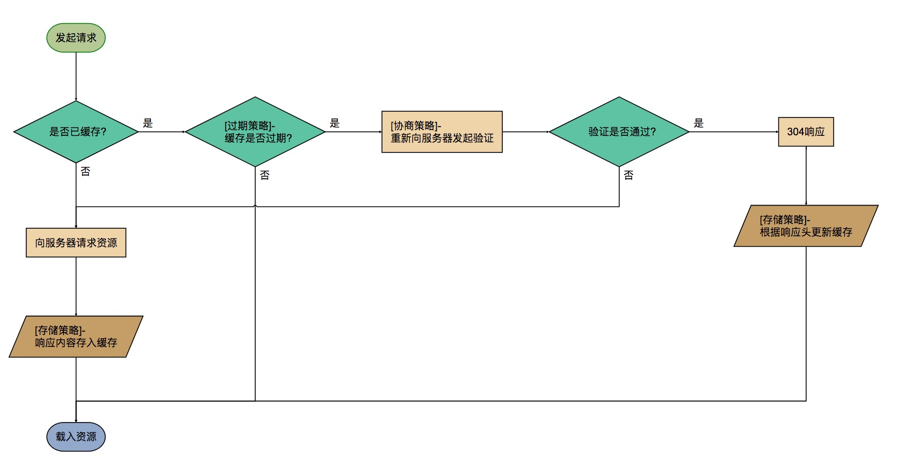

### 提升页面的常用方法
- 资源压缩合并，减少http请求，开启gzip压缩
- 非核心代码异步加载
- 利用浏览器缓存
- 使用CDN
- 预解析DNS
  ``` html
  <!-- off为关闭,ON为开启,页面中所有的a标签默认开启dns预解析，但是如果页面是https的，浏览器默认关闭预解析，这里最好开启一下 -->
  <meta http-equiv="X-dns-prefetch-control" content="on" />
  <!--如果不确定是http还是https连接的话建议如下写法 -->
  <link rel="dns-prefetch" href="//prefetchhostname.com" />
  ```
<!-- more -->
### 异步加载
##### 方法
- 动态脚本加载（动态创建节点）
- defer
- async

#####  defer、async区别

defer是在HTML解析完之后才会执行，如果是多个，则按照加载的顺序依次执行。

async加载完之后立即执行，如果是多个 ，执行顺序和加载顺序无关。

```html
<!-- defer1和async1文件内容很大-->
<!DOCTYPE html>
<html>
  <head>
    <meta charset="utf-8">
    <title>性能优化</title>
    <script src="./defer1.js" charset="utf-8" defer></script>
    <script src="./defer2.js" charset="utf-8" defer></script>
    <script src="./async1.js" charset="utf-8" async></script>
    <script src="./async2.js" charset="utf-8" async></script>
  </head>
  <body>
    <div class="">
      test
      <script type="text/javascript">
        console.log('write');
        document.write('<span>write</span>');
      </script>
      <script type="text/javascript">
        for (var i = 0; i < 3; i++) {
            console.log(i);
        }
      </script>
    </div>
  </body>
</html>
``` 
运行结果:

- write
- 1
- 2
- 3
- async2
- defer1
- defer2
- async1

### 浏览器缓存

##### 分类：
- 强缓存
- 协商缓存

###### 强缓存(直接拿缓存结果使用)

Expires: Wed, 22 Aug 2018 09:38:37 GMT

Cache-Control: Cache-Control:max-age=3600


Expires标识绝对时间，一般是服务下发的服务器绝对时间
Cache-Control是相对时间,在获取到资源之后，在3600之后，不会向服务器重新请求资源
如果服务器将两个字段都下发，则以Cache-Control为准

###### 协商缓存(使用缓存文件之前先请求服务器看是否可以使用)

Last-Modified 上次修改的时间。当强缓存失效，客户端开始请求，携带Last-Modified-Since（值为服务器下发的
Last-Modified的值）
(问题是时间可能变了 但是内容可能没有变化)

Last-Modified-Since

【Last-Modified，If-Modified-Since】都是根据服务器时间返回的header，一般来说，在没有调整服务器时间和篡改客户端缓存的情况下，这两个header配合起来管理协商缓存是非常可靠的，但是有时候也会服务器上资源其实有变化，但是最后修改时间却没有变化的情况，而这种问题又很不容易被定位出来，而当这种情况出现的时候，就会影响协商缓存的可靠性。所以就有了另外一对header来管理协商缓存，这对header就是【ETag、If-None-Match】。

Etag 服务器下发 ，当强缓存失效，客户端开始请求，携带If-None-Match（值为服务器下发的Etag的值）

If-None-Match

######  浏览器缓存机制


参考： https://juejin.im/entry/58db1a20b123db199f53005e
